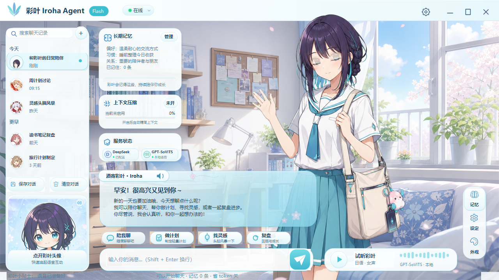

# Iroha Agent

本地娱乐陪伴向聊天 Agent。Windows 端是当前主版本，采用视觉小说式界面，支持 DeepSeek 对话、本地 GPT-SoVITS 日语语音、逐帧角色动画、长期记忆和提示词压缩。Android 端目前为 `0.1.0` 原型。

> 这是非官方同人性质的技术项目。角色、视觉素材和语音相关资源的使用与再分发必须由使用者自行确认授权。仓库建议保持私有。



## 当前能力

- DeepSeek `deepseek-v4-flash` / `deepseek-v4-pro` 模型切换
- 软件内配置 API Key，密钥仅写入当前用户的本地配置目录
- 中文文字回复与 GPT-SoVITS 日语语音播放
- 启动时检查并尝试准备本地语音服务
- 待机、思考、说话、开心、害羞、惊讶和错误等逐帧动画
- 会话新建、重命名、删除、置顶、保存与清空
- 长期记忆和本地提示词压缩
- 视觉小说对白框、快捷动作、服务状态和交互式工具栏

## 快速使用

正式 Windows 运行包不提交进 Git 历史，请从仓库的 GitHub Releases 下载并解压，然后运行：

```text
IrohaAgent.exe
```

首次启动后在设置中填写 DeepSeek API Key。不要把 API Key 写入源码、截图、Issue 或提交记录。

语音功能默认连接：

```text
http://127.0.0.1:9880
```

GPT-SoVITS 运行环境、模型权重和参考音频不包含在本仓库中。没有本地语音服务时，文字聊天仍可使用。

需要自定义本地语音运行时位置时，可设置：

```text
IROHA_GPT_SOVITS_ROOT=<GPT-SoVITS 根目录>
IROHA_VOICE_REF_AUDIO=<参考音频绝对路径>
```

## Windows 构建

要求：Windows 10/11、.NET Framework 4.x C# 编译器和 PowerShell 5.1 或更高版本。

```powershell
cd desktop
.\build.ps1
```

构建产物位于：

```text
desktop\dist\IrohaAgent.exe
```

## Android 原型构建

要求：JDK 17、Android SDK 35、Gradle 8.9。

```powershell
gradle -p android --no-daemon :app:assembleDebug
```

输出路径：

```text
android\app\build\outputs\apk\debug\app-debug.apk
```

Android 版本仍属于技术原型，不与 Windows 主版本使用同一验收结论。

## 项目结构

```text
assets/       Windows 角色帧、界面和图标资源
android/      Android 原型源码
desktop/      Windows WinForms 主版本源码与构建脚本
docs/         工程手册、验收记录和精选截图
tools/        打包、资源生成与 QA 工具
voice-pack/   语音包元数据，不包含模型权重
```

## 验收资料

- [工程验收与交接手册](docs/彩叶_Iroha_Agent_工程验收与交接手册.md)
- [设计核查记录](docs/design-qa.md)
- [V2.0 功能回归结果](docs/evidence/round-2026-07-16-v20-functional-qa.txt)
- [V2.0 语音回归结果](docs/evidence/round-2026-07-16-v20-voice-qa.txt)
- [参考图与实现对比](docs/evidence/round-2026-07-16-v20-comparison-full.png)

## 仓库边界

仓库不会包含以下内容：

- DeepSeek API Key 或其他凭据
- 用户聊天记录、长期记忆和本地设置
- GPT-SoVITS 模型权重、参考音频或完整运行时
- 本地 JDK、Android SDK、Gradle 缓存和编译输出
- Windows EXE、Android APK 和发布 ZIP；这些应作为 Release 附件上传

发布与上传步骤见 [GitHub 上传指南](docs/GITHUB_UPLOAD.md)。素材边界见 [素材与授权说明](docs/ASSET_NOTICE.md)。

## 许可

项目代码当前未授予开源许可，详见 [LICENSE](LICENSE)。第三方角色、图片和语音相关素材不包含在代码许可范围内。
