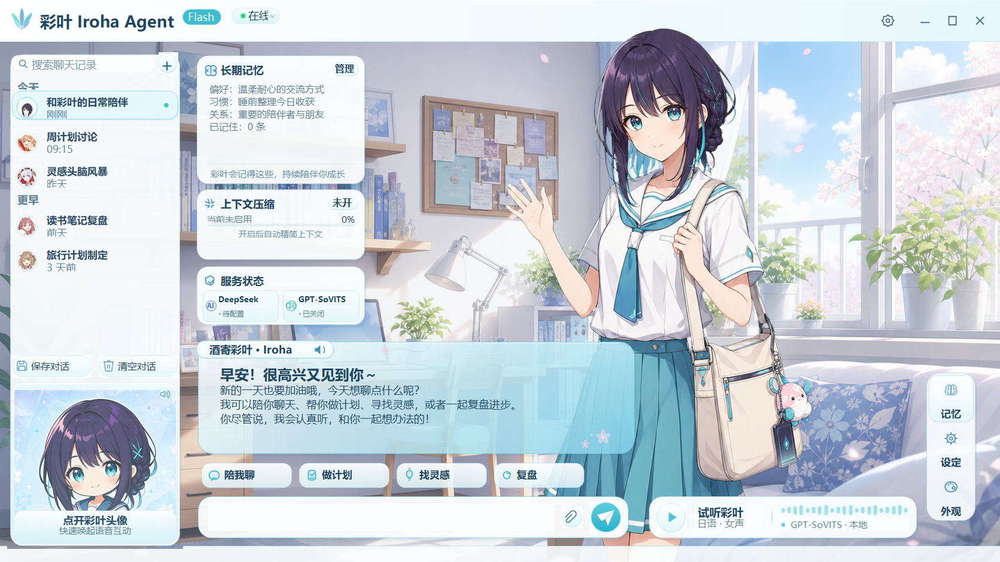
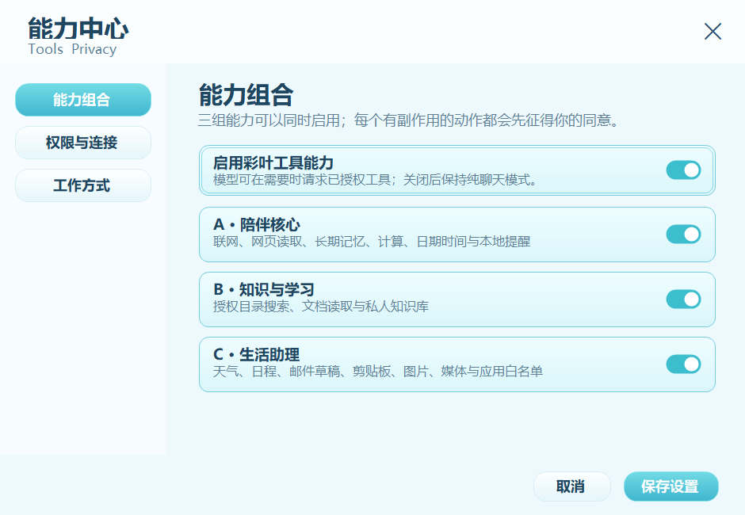
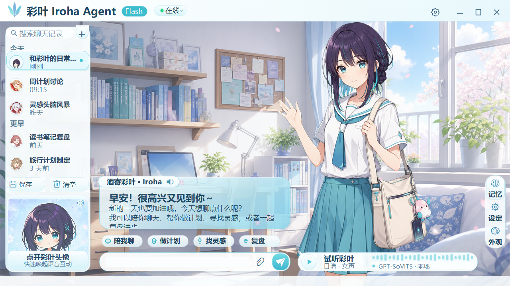
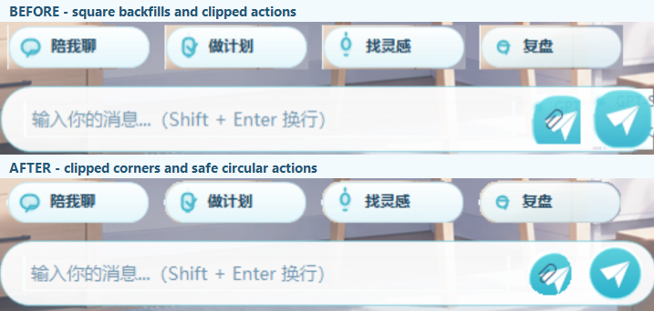

# Iroha Agent

[](https://github.com/kdjmd/Iroha-agent/releases/tag/v2.3.0)
[](https://github.com/kdjmd/Iroha-agent/actions/workflows/windows-build.yml)
[](#windows-构建)

Windows 本地娱乐陪伴向聊天 Agent。主界面采用视觉小说布局，支持多厂商大模型 API、本地 GPT-SoVITS 日语语音、自然逐帧角色动画、长期记忆、提示词压缩、会话管理，以及经过本地权限控制的 Tools 与 Skills。

**当前稳定版：v2.3.0。** [打开下载页](https://github.com/kdjmd/Iroha-agent/releases/tag/v2.3.0) · [查看完整发行说明](docs/RELEASE_NOTES_v2.3.0.md)

工程交接与本地归档入口：[工程归档索引](docs/PROJECT_ARCHIVE_INDEX.md)

> gsv语音模型来自B站up“云游雨散_”大佬的分享，所有角色立绘与背景等图像元素来自于chatgpt图像生成。



## v2.3.0 更新内容

- **模型兼容升级**：设置改为“模型厂商 → 模型”二级选择，覆盖 DeepSeek、OpenAI、Claude、Gemini、xAI、Mistral、Cohere、OpenRouter、通义千问、智谱、MiniMax、Kimi、千帆、混元、豆包、Ollama、LM Studio 和自定义 OpenAI 兼容接口。
- **Tools 与 Skills 正式可用**：新增 18 个权限受控 Tool 和 10 个可选 Skill，支持联网搜索、长期记忆、提醒、文档/PDF、私人知识库、天气、本地日历、邮件草稿、图片理解和受控系统操作。
- **密钥与接口安全**：不同厂商的 API Key 分开保存，并使用 Windows CurrentUser DPAPI 加密；远程明文 HTTP、私网探测、目录越界和敏感错误回显均被拦截。
- **语音部署增强**：首次启动自动匹配 GPT-SoVITS，显示部署进度；设置中新增“重新部署语音”，失败时保留旧运行时和原始模型包。
- **多尺寸 UI 稳定性修复**：能力卡不再出现黑色硬边或系统虚线焦点框；试听文字、波形和引擎状态严格分区；快捷操作使用真实圆角裁切；回形针与发送按钮使用独立圆形区域和安全边距，附件圆钮只绘制回形针，不再与纸飞机重合、出现方形底色、白缝或边缘裁切。布局矩阵覆盖 `980×552` 至 `1920×1080`，并在 Windows 150% 缩放下实机截图复核。
- **记忆与配置可靠性**：设置、记忆及本地工具数据采用原子写入、备份恢复和损坏文件隔离，旧版 DeepSeek 配置与明文 Key 会安全迁移。
- **附件拖放**：图片、TXT/Markdown、Office Open XML 文档、文字型 PDF 与常用代码/数据文件可直接拖入整个会话输入栏，也可点击回形针选择；不支持格式和超限文件会即时给出反馈。
- **完整验收资料**：Windows 编译、模型协议、设置 UI、长期记忆、语音部署和 61 项 Tools 安全回归均已通过；本地统一回归共 684 项检查全部通过。







## 当前能力

- 设置中先选模型厂商、再选模型；顶部徽标与服务状态同步显示当前厂商
- 兼容 OpenAI Responses、OpenAI Chat Completions、Anthropic Messages、Gemini GenerateContent、Cohere Chat 与 Azure OpenAI 协议
- 内置 DeepSeek、OpenAI、Claude、Gemini、xAI、Mistral、Cohere、OpenRouter、通义千问、智谱、MiniMax、Kimi、千帆、混元、豆包等 27 个常用入口
- 支持刷新模型列表、手动填写新模型，以及自定义 OpenAI 兼容地址；Ollama / LM Studio 本地服务可不填 Key
- 每个厂商分别记住 API Key、模型和接口地址；Key 使用当前 Windows 用户级 DPAPI 加密，发布包不包含任何用户密钥、聊天记录或记忆
- 中文聊天文字与 GPT-SoVITS 日语语音同步输出
- 首次启动自动查找或部署 GPT-SoVITS，并自动匹配彩叶语音模型和参考音频
- 部署前检查分卷完整性和磁盘空间；新运行时验证成功后才替换旧版本，失败自动恢复
- 自动处理只读推理配置和 Numba 缓存，兼容不同 Windows 用户目录与环境变量组合
- 首次部署实时进度动画；后续启动直接连接，不重复解压
- 设置内“重新部署语音”，仅替换应用托管副本，不修改原始语音包或外部运行时
- 待机、眨眼、思考、说话、开心、害羞、惊讶和错误等自然逐帧动画
- 会话新建、重命名、删除、置顶、保存与清空
- 图片与常用文档可点击回形针添加，或直接拖入整个会话输入栏；附件名称和待发送状态会立即显示
- 长期记忆、提示词压缩、快捷动作和视觉小说对白框
- A/B/C 三组 18 个 Tools：联网与提醒、文档与知识库、天气与本地日程、邮件草稿、剪贴板、图片理解、媒体键和应用白名单
- 10 个可选 Skill 工作方式：日常陪伴、记忆整理、联网核查、计划复盘、学习、阅读、旅行、隐私守护与语音表演
- OpenAI Responses、OpenAI/DeepSeek Chat、Anthropic、Gemini、Cohere 原生 Tool Calling；最多 4 轮调用、参数 Schema 校验、超时和结果长度限制
- 写入、删除、剪贴板、图片和系统控制每次确认；不提供任意命令、自动发送邮件、支付或任意文件删除

## 下载版本

请从 [Iroha Agent v2.3.0 Release](https://github.com/kdjmd/Iroha-agent/releases/tag/v2.3.0) 下载。GitHub Release 提供两个 Windows 版本：

| 版本 | 内容 | 适用场景 |
|---|---|---|
| `IrohaAgent-Windows-v2.3.0-Portable.zip` | 应用与高清视觉资源，约 31 MB | 已安装 GPT-SoVITS，或只需要文字聊天 |
| `IrohaAgent-Windows-v2.3.0-FullVoice.7z.001` 等分卷 | 应用、完整 GPT-SoVITS 运行时、彩叶模型与 7-Zip | 新电脑首次安装，希望自动启用语音 |

FullVoice 需要下载全部分卷，并使用 7-Zip 从 `.001` 解压。首次语音部署需要约 14 GB 安装空间，建议至少预留 20 GB 可用空间。

从 v2.1.x 或 v2.2.x 升级时，先关闭旧程序，再完整解压 v2.3.0 到新目录运行。用户设置和记忆会从 `%LOCALAPPDATA%` 或旧版 `%APPDATA%` 自动读取，无需覆盖旧安装目录；API Key 若来自另一台电脑或 Windows 账户，需要重新填写。

本次仓库和 Release 只提供 Windows 版本，不提供 APK。

## 快速使用

1. 完整解压所选版本，不要只单独拖出 EXE。
2. 运行 `IrohaAgent.exe`。
3. 在右侧“设置”中先选择模型厂商，再选择模型并填写该厂商自己的 API Key。
4. 打开“工具与隐私”，按需启用 A/B/C 能力组、授权目录与应用白名单。
5. FullVoice 首次启动时等待语音部署进度完成。

模型更新后可点击“刷新”读取厂商模型列表，也可直接输入模型 ID。语音异常时，切换到设置中的“语音与记忆”页，点击“重新部署 GPT-SoVITS 语音”。文字聊天不依赖本地语音服务，部署失败时仍可使用。

API Key 必须属于当前选择的厂商，并拥有所选模型权限。AWS Bedrock SigV4、Google Vertex OAuth 等非 API-Key 鉴权不等同于普通 Key；这类平台需要专用凭据流程，不能仅把凭据粘贴进 API Key 框。

## 本地数据

新安装默认位置（检测到旧版 `%APPDATA%` 数据时会继续沿用并自动恢复）：

```text
%LOCALAPPDATA%\IrohaLocalAgent\settings.json
%LOCALAPPDATA%\IrohaLocalAgent\memory.json
%LOCALAPPDATA%\IrohaLocalAgent\reminders.json
%LOCALAPPDATA%\IrohaLocalAgent\calendar.json
%LOCALAPPDATA%\IrohaLocalAgent\email-drafts.json
%LOCALAPPDATA%\IrohaLocalAgent\knowledge-base.json
%LOCALAPPDATA%\IrohaLocalAgent\VoiceRuntime\
%LOCALAPPDATA%\IrohaLocalAgent\Voice\iroha\
%LOCALAPPDATA%\IrohaLocalAgent\VoiceCache\
```

设置与记忆采用临时文件、原子替换和 `.bak` 恢复；损坏文件会保留为 `.corrupt`，不会静默清空长期记忆。

各厂商 API Key 使用 Windows DPAPI（`CurrentUser`）加密后写入当前用户的 `settings.json`，不会写入仓库或发布包。旧版明文设置会在首次成功读取后自动迁移；复制到其他电脑或其他 Windows 账户时无法解密，需要重新填写 Key。

高级覆盖项：

```text
IROHA_GPT_SOVITS_ROOT=<GPT-SoVITS 根目录>
IROHA_VOICE_CONFIG=<tts_infer yaml 绝对路径>
IROHA_VOICE_REF_AUDIO=<参考音频绝对路径>
IROHA_VOICE_PACKAGE=<GSV 语音包 zip 绝对路径>
IROHA_VOICE_MANAGED_ROOT=<应用托管语音目录>
IROHA_VOICE_STARTUP_TIMEOUT_SECONDS=<15-1200 秒，仅用于高级诊断>
```

## Windows 构建

要求：Windows 10/11、PowerShell 5.1+、.NET Framework 4.x C# 编译器。

```powershell
cd desktop
.\build.ps1
```

输出为 `IrohaAgent.exe`、PDF 解析依赖 DLL、启动脚本和资源目录：

```text
desktop\dist\IrohaAgent.exe
```

## 项目结构

```text
.github/       Windows CI
assets/        高清角色帧、表情、界面和应用图标
desktop/       WinForms 主程序、模型协议适配器、语音引导模块与构建脚本
docs/          工程手册、验收记录、授权说明和精选截图
tools/         Windows 发布、资源生成与自动化 QA 工具
voice-pack/    语音集成元数据，不包含权重和音频
```

## 验收资料

- [Windows 工程验收与交接手册](docs/彩叶_Iroha_Agent_工程验收与交接手册.md)
- [设计核查记录](docs/design-qa.md)
- [Tools 与 Skills 实施说明](docs/TOOLS_AND_SKILLS_PROPOSAL.md)
- [Tools 使用指南](docs/TOOLS_USER_GUIDE.md)
- [Tools 架构与权限边界](docs/TOOLS_ARCHITECTURE.md)
- [V2.3 Tools 回归（61 项）](docs/evidence/round-2026-07-18-v23-agent-tools-qa.txt)
- [V2.3 设置与能力中心视觉回归](docs/evidence/round-2026-07-18-v23-settings-ui-qa.txt)
- [V2.3 能力中心截图](docs/evidence/round-2026-07-18-v23-tools-center.png)
- [V2.3 紧凑布局语音区截图](docs/evidence/round-2026-07-19-v23-compact-voice-dock.png)
- [V2.3 紧凑布局与设置 UI 回归](docs/evidence/round-2026-07-19-v23-settings-ui-qa.txt)
- [V2.3 UI 稳定性完整截图](docs/evidence/round-2026-07-19-v23-ui-stability-main.png)
- [V2.3 UI 稳定性最小窗口截图](docs/evidence/round-2026-07-19-v23-ui-stability-minimum.png)
- [V2.3 UI 稳定性 261 项布局回归](docs/evidence/round-2026-07-19-v23-ui-stability-qa.txt)
- [V2.3 底部 UI 修复前后对比](docs/evidence/round-2026-07-20-v23-bottom-ui-comparison.png)
- [V2.3 底部 UI 最终实机截图](docs/evidence/round-2026-07-20-v23-bottom-ui-final.png)
- [V2.3 设置与 UI 338 项最终回归](docs/evidence/round-2026-07-20-v23-bottom-ui-qa.txt)
- [V2.3 附件与拖放最终界面](docs/evidence/round-2026-07-20-v23-attachment-drop-main.png)
- [V2.3 附件与拖放功能回归（47 项）](docs/evidence/round-2026-07-20-v23-attachment-drop-functional-qa.txt)
- [V2.3 附件与拖放设置/UI 回归（382 项）](docs/evidence/round-2026-07-20-v23-attachment-drop-settings-ui-qa.txt)
- [V2.1 功能回归](docs/evidence/round-2026-07-16-v21-functional-qa.txt)
- [V2.1 自动部署回归](docs/evidence/round-2026-07-16-v21-bootstrap-qa.txt)
- [V2.1 完整运行时语音回归](docs/evidence/round-2026-07-16-v21-full-voice-qa.txt)
- [V2.1.1 记忆回归](docs/evidence/round-2026-07-17-v211-memory-qa.txt)
- [V2.1.1 跨电脑部署回归](docs/evidence/round-2026-07-17-v211-bootstrap-qa.txt)
- [V2.1.1 功能与会话菜单回归](docs/evidence/round-2026-07-17-v211-functional-qa.txt)
- [V2.1.1 真实语音端到端回归](docs/evidence/round-2026-07-17-v211-full-voice-qa.txt)
- [V2.2.1 模型厂商设置截图](docs/evidence/round-2026-07-18-v221-model-settings.png)
- [V2.2.1 语音与记忆设置截图](docs/evidence/round-2026-07-18-v221-voice-settings.png)
- [V2.2 模型协议与配置迁移回归](docs/evidence/round-2026-07-17-v22-model-providers-qa.txt)
- [V2.2.1 设置页视觉回归](docs/evidence/round-2026-07-18-v221-settings-ui-qa.txt)
- [V2.2 功能回归](docs/evidence/round-2026-07-17-v22-functional-qa.txt)
- [V2.2 记忆持久化回归](docs/evidence/round-2026-07-17-v22-memory-qa.txt)
- [V2.2 语音部署回归](docs/evidence/round-2026-07-17-v22-voice-bootstrap-qa.txt)
- [V2.2.1 DPAPI、接口安全与 Cohere 修复回归](docs/evidence/round-2026-07-18-v221-security-qa.txt)
- [首次部署进度窗](docs/evidence/round-2026-07-16-v21-deployment-progress.png)

## 仓库边界

Git 历史不包含：

- 任意模型厂商 API Key、用户设置、聊天记录、长期记忆或崩溃日志
- GPT-SoVITS 完整运行时、模型权重、参考音频和 FullVoice 分卷
- Windows EXE、发布 ZIP/7Z、临时音频与构建输出

这些内容应由发布脚本在仓库外生成。上传步骤见 [GitHub 上传指南](docs/GITHUB_UPLOAD.md)，素材边界见 [素材与授权说明](docs/ASSET_NOTICE.md)。

## 常见语音故障

- FullVoice 缺少任一 `.7z.00N`：应用会指出具体缺失分卷，不会破坏旧运行时。
- 首次加载较慢：CPU 兼容模式允许最长 10 分钟，并持续显示加载进度；超时后会关闭本次服务。
- 端口被占用：应用会在 `9880-9899` 中选择可用端口并保存，下次直接复用。
- 语音仍不可用：在设置中点击“重新部署语音”；原始语音包与外部 GPT-SoVITS 不会被删除。
- 会话菜单曾反复弹错：v2.1.1 已改为延迟释放菜单并限制同一运行周期只显示一次全局异常提示。

## 常见模型故障

- `401/403`：确认 Key 属于当前厂商、仍有效且拥有所选模型权限。
- `404`：模型 ID 或 API 地址不匹配；点击“刷新”，或按厂商控制台显示的模型 ID 手动填写。
- 本地模型无响应：先在 Ollama / LM Studio 中启动并加载模型，再测试 `127.0.0.1` 对应接口。
- 新平台未列出：选择“自定义 OpenAI 兼容接口”，填写 Base URL、模型 ID 和可选 Key。
- 模型不调用 Tool：确认“工具与隐私”总开关及对应能力组已开启；不支持 Tool Schema 的旧模型会安全降级为普通聊天。
- 图片只有尺寸和颜色：当前模型不支持视觉输入；更换支持多模态的模型后重试。

## 许可

项目代码当前未授予开源许可，详见 [LICENSE](LICENSE)。第三方角色、图片和语音相关素材不包含在代码许可范围内。
