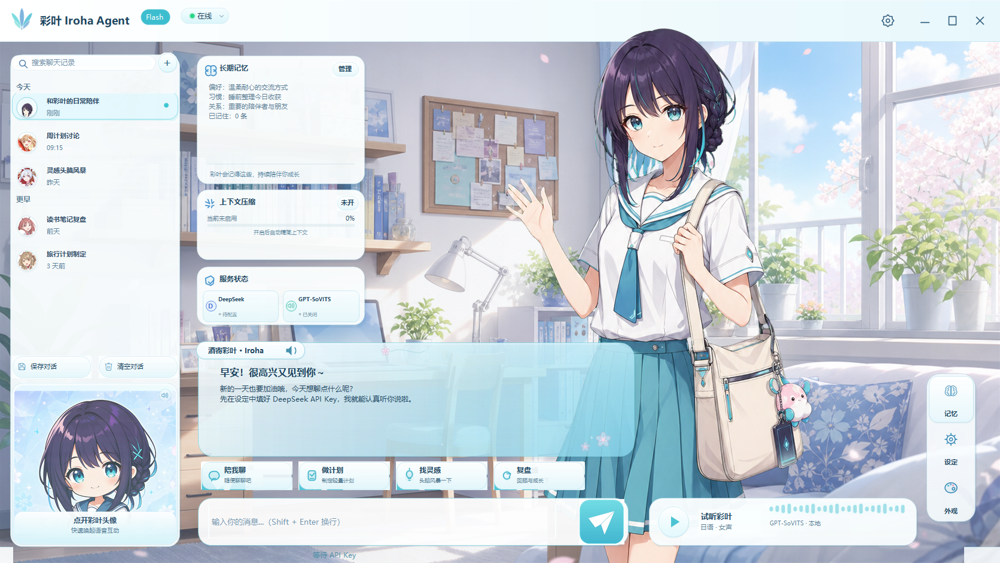

# Iroha Agent

Windows 本地娱乐陪伴向聊天 Agent。主界面采用视觉小说布局，支持 DeepSeek 对话、本地 GPT-SoVITS 日语语音、自然逐帧角色动画、长期记忆、提示词压缩与会话管理。

> gsv语音模型来自B站up云游雨散大佬的分享，所有角色立绘与背景等图像元素来自于chatgpt图像生成。



## 当前能力

- DeepSeek `deepseek-v4-flash` / `deepseek-v4-pro` 模型切换，标题徽标同步显示 Flash / Pro
- 软件内设置 API Key；发布包不包含任何用户密钥、聊天记录或记忆
- 中文聊天文字与 GPT-SoVITS 日语语音同步输出
- 首次启动自动查找或部署 GPT-SoVITS，并自动匹配彩叶语音模型和参考音频
- 首次部署实时进度动画；后续启动直接连接，不重复解压
- 设置内“重新部署语音”，仅替换应用托管副本，不修改原始语音包或外部运行时
- 待机、眨眼、思考、说话、开心、害羞、惊讶和错误等自然逐帧动画
- 会话新建、重命名、删除、置顶、保存与清空
- 长期记忆、提示词压缩、快捷动作和视觉小说对白框

## 下载版本

GitHub Release 提供两个 Windows 版本：

| 版本 | 内容 | 适用场景 |
|---|---|---|
| `Portable.zip` | 应用与高清视觉资源，约 30 MB | 已安装 GPT-SoVITS，或只需要文字聊天 |
| `FullVoice.7z.001` 等分卷 | 应用、完整 GPT-SoVITS 运行时、彩叶模型与 7-Zip | 新电脑首次安装，希望自动启用语音 |

FullVoice 需要下载全部分卷，并使用 7-Zip 从 `.001` 解压。首次语音部署需要约 14 GB 安装空间，建议至少预留 20 GB 可用空间。

本次仓库和 Release 只提供 Windows 版本，不提供 APK。

## 快速使用

1. 完整解压所选版本，不要只单独拖出 EXE。
2. 运行 `IrohaAgent.exe`。
3. 在右侧“设置”中填写自己的 DeepSeek API Key。
4. FullVoice 首次启动时等待语音部署进度完成。

语音异常时，在设置浮窗点击“重新部署语音”。文字聊天不依赖本地语音服务，部署失败时仍可使用。

## 本地数据

默认位置：

```text
%APPDATA%\IrohaLocalAgent\settings.json
%APPDATA%\IrohaLocalAgent\memory.json
%LOCALAPPDATA%\IrohaLocalAgent\VoiceRuntime\
%LOCALAPPDATA%\IrohaLocalAgent\Voice\iroha\
```

API Key 当前保存在当前 Windows 用户的 `settings.json` 中，不会写入仓库或发布包。共享电脑上应使用独立 Windows 账户；生产化前建议迁移到 Windows Credential Manager 或 DPAPI。

高级覆盖项：

```text
IROHA_GPT_SOVITS_ROOT=<GPT-SoVITS 根目录>
IROHA_VOICE_CONFIG=<tts_infer yaml 绝对路径>
IROHA_VOICE_REF_AUDIO=<参考音频绝对路径>
IROHA_VOICE_PACKAGE=<GSV 语音包 zip 绝对路径>
IROHA_VOICE_MANAGED_ROOT=<应用托管语音目录>
```

## Windows 构建

要求：Windows 10/11、PowerShell 5.1+、.NET Framework 4.x C# 编译器。

```powershell
cd desktop
.\build.ps1
```

输出：

```text
desktop\dist\IrohaAgent.exe
```

构建 GitHub Release：

```powershell
.\tools\build-windows-release.ps1 -Version 2.1.0

.\tools\build-windows-release.ps1 `
  -Version 2.1.0 `
  -FullVoice `
  -RuntimeArchive "D:\GPT-SoVITS-runtime.7z" `
  -VoicePackage "D:\iroha-model.zip"
```

完整版本会自动生成不超过约 1.9 GB 的分卷和 `SHA256SUMS.txt`，便于作为 GitHub Release 附件上传。

## 项目结构

```text
.github/       Windows CI
assets/        高清角色帧、表情、界面和应用图标
desktop/       WinForms 主程序、语音引导模块与构建脚本
docs/          工程手册、验收记录、授权说明和精选截图
tools/         Windows 发布、资源生成与自动化 QA 工具
voice-pack/    语音集成元数据，不包含权重和音频
```

## 验收资料

- [Windows 工程验收与交接手册](docs/彩叶_Iroha_Agent_工程验收与交接手册.md)
- [设计核查记录](docs/design-qa.md)
- [V2.1 功能回归](docs/evidence/round-2026-07-16-v21-functional-qa.txt)
- [V2.1 自动部署回归](docs/evidence/round-2026-07-16-v21-bootstrap-qa.txt)
- [V2.1 完整运行时语音回归](docs/evidence/round-2026-07-16-v21-full-voice-qa.txt)
- [首次部署进度窗](docs/evidence/round-2026-07-16-v21-deployment-progress.png)

## 仓库边界

Git 历史不包含：

- DeepSeek API Key、用户设置、聊天记录、长期记忆或崩溃日志
- GPT-SoVITS 完整运行时、模型权重、参考音频和 FullVoice 分卷
- Windows EXE、发布 ZIP/7Z、临时音频与构建输出

这些内容应由发布脚本在仓库外生成。上传步骤见 [GitHub 上传指南](docs/GITHUB_UPLOAD.md)，素材边界见 [素材与授权说明](docs/ASSET_NOTICE.md)。

## 许可

项目代码当前未授予开源许可，详见 [LICENSE](LICENSE)。第三方角色、图片和语音相关素材不包含在代码许可范围内。
