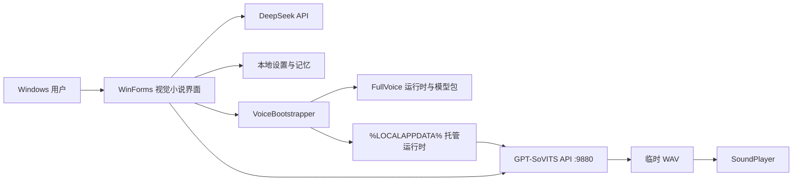

# 彩叶 Iroha Agent Windows 工程验收与交接手册

## 1. 文档控制

| 项目 | 内容 |
|---|---|
| 产品 | 彩叶 Iroha Agent |
| 基线版本 | 2.1.1 |
| 平台 | Windows 10/11 x64 |
| 文档日期 | 2026-07-17 |
| 主程序 | .NET Framework WinForms |
| 模型服务 | DeepSeek HTTP API |
| 本地语音 | GPT-SoVITS HTTP API |
| 仓库形态 | Windows-only 源码仓库 |
| 建议验收结论 | 有条件通过 |

“有条件通过”表示：源码构建、独立运行、视觉小说主界面、主要交互、首次语音部署、重新部署、真实语音生成与发布打包均已通过；DeepSeek 真实计费请求、最终主观听感、第三方素材授权和长时间稳定性仍由发布者在自己的账户与目标设备上确认。

## 2. 产品范围

### 2.1 已交付

- Windows 本地视觉小说式聊天界面。
- DeepSeek Flash / Pro 模型配置与 API Key 设置。
- 中文文字回复、日语 GPT-SoVITS 语音播放。
- 首次启动自动发现或部署 GPT-SoVITS。
- GSV 模型、参考音频、提示文本和推理配置自动匹配。
- 语音部署实时进度动画和失败降级。
- 设置内安全重新部署。
- 长期记忆、提示词压缩、会话管理和快捷动作。
- 自然眨眼、口型和多情绪逐帧动画。
- Portable 与 FullVoice Windows 发布格式。

### 2.2 不在本基线内

- 云端账户、跨设备同步和多用户服务。
- 生产级遥测、远程日志和自动更新。
- DeepSeek API 费用托管。
- 对第三方角色、图片或语音素材的授权承诺。
- 代码签名证书与 Microsoft Store 发布。

## 3. 架构总览



架构保持单体桌面应用：UI、业务编排和 HTTP 客户端位于一个 WinForms 进程；GPT-SoVITS 作为本机子进程提供 `127.0.0.1:9880` 服务。大型运行时与模型不进入 Git 历史，由 FullVoice Release 在首次启动时部署。

## 4. 模块与职责

| 文件或目录 | 职责 | 变更注意事项 |
|---|---|---|
| `desktop/AgentDesktop.cs` | 主窗体、DeepSeek、语音请求、记忆、会话和自绘 UI | 业务代码集中，修改后必须跑功能和截图 QA |
| `desktop/VoiceBootstrap.cs` | 语音发现、解压、模型导入、配置生成、进度窗和安全清理 | 涉及大文件和进程，必须保持路径边界检查 |
| `desktop/build.ps1` | 调用 .NET Framework `csc.exe` 并复制资源 | 非零编译退出码必须立即失败 |
| `assets/character` | 立绘、表情和逐帧动画 | 发布包必须保留相对目录 |
| `assets/ui` | 背景和界面资源 | 不要用模糊截图覆盖交互控件 |
| `tools/build-windows-release.ps1` | Portable、FullVoice 分卷与哈希清单 | Release 在仓库外生成 |
| `tools/*QaHarness.cs` | 功能、动画、部署和语音自动验收 | 使用隔离数据目录，禁止读取真实 API Key |
| `voice-pack/manifest.json` | 语音包工程元数据 | 不包含模型权重和音频 |

## 5. 首次语音部署

### 5.1 状态流程

1. 检查 `settings.json` 中已匹配的运行时、配置和参考音频。
2. 检查本机配置端口的 `/openapi.json` 是否包含真实 `/tts` 接口。
3. 查找用户指定、应用目录、托管目录和常见位置中的 GPT-SoVITS。
4. 校验 FullVoice 分卷连续性、归档可读性和磁盘空间；解压到独立临时目录。
5. 查找或导入 `.ckpt`、`.pth`、`.wav` 和 `.list`。
6. 从训练列表读取参考音频文件名、日语提示文本和语言。
7. 将有效 `tts_infer_iroha.yaml` 复制或生成到应用可写托管目录，原始运行时保持不变。
8. 新运行时完整校验后原子切换，写入 `.deployment-ready`；失败自动恢复旧运行时。
9. 通过 Python 引导脚本设置独立 Numba 缓存，启动 `api_v2.py` 并按墙钟时间轮询健康状态。
10. 自动处理 `9880-9899` 端口占用并保存实际端口。
11. 保存运行时、配置、参考音频与匹配版本。
12. 进度窗显示完成；以后启动直接连接。

### 5.2 进度区间

| 区间 | 状态 |
|---|---|
| 0-17% | 环境与已有运行时检查 |
| 18-62% | GPT-SoVITS 解压 |
| 64-82% | 彩叶模型和参考音频导入 |
| 86-99% | 本地服务和模型加载 |
| 100% | 健康检查通过 |

进度窗口是独立无边框 owner-drawn 窗体。部署期间主界面仍可查看，文字聊天不依赖语音部署结果。

### 5.3 兼容性策略

自动生成配置默认：

```yaml
device: cpu
is_half: false
```

原因：CPU 全精度不依赖 NVIDIA 驱动、CUDA 版本或可用显存，是跨电脑首次启动最稳定的默认值。未来增加 GPU 模式时，应在设置中显式选择并执行独立能力探测，不能把 GPU 作为无条件默认。

Python 子进程不得通过旧版 `.NET ProcessStartInfo.EnvironmentVariables` 注入变量；部分 Windows 同时存在 `Path` / `PATH` 时会触发大小写冲突。当前使用 `-X utf8 -u` 和托管 `start_voice.py` 设置 `NUMBA_CACHE_DIR`，兼顾实时诊断与跨电脑兼容。

## 6. 重新部署安全约束

“重新部署语音”必须遵守以下不变量：

- 只递归删除 `VoiceBootstrapper.ManagedBaseDirectory` 下的目录。
- 删除前使用绝对路径验证目标位于托管根目录内。
- 不删除桌面原始语音 ZIP。
- 不删除用户自行安装的外部 GPT-SoVITS。
- 没有可恢复的随包运行时归档时，不删除唯一的托管运行时，仅重建语音配置。
- 新部署只在临时目录完成，验证前保留旧运行时；缺失分卷或中断后恢复最后可用版本。
- GPT-SoVITS 使用托管 YAML 副本和缓存目录，不要求外部运行时可写。
- 只停止可执行文件路径位于目标运行时中的 `python/pythonw` 进程。
- 重新部署失败时文字聊天继续可用。

默认托管位置：

```text
%LOCALAPPDATA%\IrohaLocalAgent\VoiceRuntime\
%LOCALAPPDATA%\IrohaLocalAgent\Voice\iroha\
```

## 7. 设置与本地数据

| 数据 | 默认位置 | 内容 |
|---|---|---|
| 应用设置 | 新安装 `%LOCALAPPDATA%\IrohaLocalAgent\settings.json`；旧安装沿用 `%APPDATA%` | API、模型、语音路径与开关 |
| 长期记忆 | 与设置同目录的 `memory.json` | 用户偏好和本地记忆；原子保存、备份恢复 |
| 托管运行时 | `%LOCALAPPDATA%\IrohaLocalAgent\VoiceRuntime` | 解压后的 GPT-SoVITS |
| 托管模型 | `%LOCALAPPDATA%\IrohaLocalAgent\Voice\iroha` | 权重、参考音频和 YAML |
| 语音缓存 | `%LOCALAPPDATA%\IrohaLocalAgent\VoiceCache` | Python 引导脚本与 Numba 缓存 |
| 临时语音 | `%TEMP%\iroha-agent-voice-*.wav` | 播放后删除 |
| 崩溃日志 | `%LOCALAPPDATA%\IrohaLocalAgent\crash.log` | 仅在首个未处理异常时写入，不在主界面展示或上传 |

关键设置字段：

| 字段 | 含义 |
|---|---|
| `Model` | `deepseek-v4-flash` 或 `deepseek-v4-pro` |
| `VoiceRuntimeRoot` | 当前使用的 GPT-SoVITS 根目录 |
| `VoiceRuntimeConfigPath` | 当前推理 YAML |
| `VoiceRefAudioPath` | 当前参考音频 |
| `VoicePromptText` | 参考音频对应的日语文本 |
| `VoicePromptLang` | 默认 `ja` |
| `VoiceAutoMatched` | 是否已完成自动匹配 |
| `VoiceMatchVersion` | 匹配规则版本，当前为 3 |

## 8. 构建

### 8.1 主程序

```powershell
cd desktop
.\build.ps1
```

构建成功条件：

- `desktop/dist/IrohaAgent.exe` 存在。
- `desktop/dist/assets` 包含角色帧、表情与 UI 图。
- 编译器返回码为 0。
- 发布目录不包含用户设置和密钥。

### 8.2 Release

```powershell
.\tools\build-windows-release.ps1 -Version 2.1.1
```

完整语音版：

```powershell
.\tools\build-windows-release.ps1 `
  -Version 2.1.1 `
  -FullVoice `
  -RuntimeArchive "C:\path\GPT-SoVITS-runtime.7z" `
  -VoicePackage "C:\path\iroha-model.zip"
```

发布脚本默认先执行统一回归，再完成构建、复制、敏感文件检查、Portable ZIP、FullVoice 1.9 GB 分卷、Release 说明和 SHA-256 清单。仅诊断时才允许显式使用 `-SkipQa`。

## 9. 验收矩阵

| 编号 | 验收项 | 结果 | 证据 |
|---|---|---|---|
| W-01 | Windows 编译 | 通过 | `desktop/build.ps1` |
| W-02 | 无系统边框与视觉小说主界面 | 通过 | v2.1 标准与设置截图证据 |
| W-03 | 标准与紧凑窗口主要控件可见 | 通过 | v2.1 功能 QA |
| W-04 | 会话重命名、删除、置顶 | 通过 | v2.1 功能 QA |
| W-05 | 设置浮窗和重新部署入口无重叠 | 通过 | v2.1 功能 QA |
| W-06 | Flash / Pro 徽标状态 | 通过 | v2.1 功能 QA |
| W-07 | 高清背景或立绘缺失、损坏时阻止占位 UI | 通过 | v2.1 视觉资源保护 QA |
| W-08 | 会话菜单关闭期间保持存活并在消息处理后释放 | 通过 | v2.1.1 功能 QA |
| V-01 | 真实服务健康检查 | 通过 | v2.1 完整语音 QA |
| V-02 | 日语 WAV 生成 | 通过 | 4.74 秒音频 |
| V-03 | 音频非静音与自动峰值处理 | 通过 | 峰值约 -1.1 dBFS |
| V-04 | SoundPlayer 播放和临时文件清理 | 通过 | v2.1 完整语音 QA |
| B-01 | 已有外部运行时自动匹配 | 通过 | v2.1 Bootstrap QA |
| B-02 | FullVoice 7-Zip 自动部署 | 通过 | v2.1 Bootstrap QA 与完整解压 |
| B-03 | GSV 权重、参考音频和提示文本导入 | 通过 | v2.1 Bootstrap QA |
| B-04 | 重新部署替换托管旧文件 | 通过 | v2.1 Bootstrap QA |
| B-05 | 源语音包哈希不变 | 通过 | v2.1 Bootstrap QA |
| B-06 | 外部运行时哨兵文件不变 | 通过 | v2.1 Bootstrap QA |
| B-07 | 分卷缺失时保留最后可用运行时并指出具体分卷 | 通过 | v2.1.1 Bootstrap QA |
| B-08 | 只读运行时 YAML 复制到托管目录且源哈希不变 | 通过 | v2.1.1 Bootstrap QA |
| B-09 | 跨 Windows 用户路径自动重新匹配 | 通过 | v2.1.1 Bootstrap QA |
| M-01 | 记忆原子保存、并发写入与损坏恢复 | 通过 | v2.1.1 Memory QA |
| M-02 | 一次性任务和 API 密钥不进入长期记忆 | 通过 | v2.1.1 Memory QA |
| P-01 | Portable ZIP 与哈希 | 通过 | 发布脚本 QA |
| P-02 | FullVoice 五分卷与哈希 | 通过 | 发布脚本 QA |

## 10. 验收证据索引

```text
docs/evidence/round-2026-07-16-v21-functional-qa.txt
docs/evidence/round-2026-07-16-v21-bootstrap-qa.txt
docs/evidence/round-2026-07-16-v21-full-voice-qa.txt
docs/evidence/round-2026-07-16-v21-visual-asset-guard-qa.txt
docs/evidence/round-2026-07-16-v21-deployment-progress.png
docs/evidence/round-2026-07-16-v21-settings.png
docs/evidence/round-2026-07-16-v21-standard.png
docs/evidence/round-2026-07-17-v211-functional-qa.txt
docs/evidence/round-2026-07-17-v211-bootstrap-qa.txt
docs/evidence/round-2026-07-17-v211-memory-qa.txt
docs/evidence/round-2026-07-17-v211-full-voice-qa.txt
```

## 11. 故障排查

| 现象 | 检查 | 处理 |
|---|---|---|
| 首次部署找不到运行时 | FullVoice 的 `voice-runtime` 和全部分卷是否完整 | 重新完整解压发布包 |
| 提示缺少 7-Zip | `voice-runtime/tools/7z.exe` 与 `7z.dll` | 重新下载 FullVoice |
| 部署磁盘不足 | `%LOCALAPPDATA%` 所在磁盘剩余空间 | 至少释放 20 GB |
| 服务启动超时 | CPU 占用、杀毒软件、Numba 缓存 | 等待进度；应用最长 10 分钟后清理本次进程，可重新部署 |
| 端口被占用 | `9880-9899` 是否有其他服务 | 应用自动选择可用端口并保存，不需要手工改端口 |
| OpenAPI 可访问但无音频 | 是否存在真实 `/tts`、YAML 权重路径和参考音频 | 点击重新部署；应用不会把无关本地服务误判为 GPT-SoVITS |
| 记忆突然为空 | `memory.json.bak` 与 `.corrupt` | 应用会自动从备份恢复；保留损坏副本供人工核查 |
| 语音很小或静音 | WAV 长度、峰值和 RMS | 应用会拒绝无效/近静音响应并显示不可用 |
| 只有文字没有声音 | 语音开关、服务状态、系统输出设备 | 开启日语语音并试听 |
| DeepSeek 无回复 | API Key、模型名、网络和账户余额 | 在设置中保存并重新测试 |
| 点击会话菜单后反复弹错 | 旧版 `crash.log` 是否包含 `ContextMenuStrip` / `ObjectDisposedException` | 升级至 v2.1.1；菜单改为延迟释放，同一次运行不会重复弹全局错误 |

## 12. 安全与隐私

- API Key 不写入源码、Release、截图或 QA 报告。
- 本地 HTTP 语音服务只绑定 `127.0.0.1`。
- Release 构建检查 `settings.json`、`memory.json`、`.env` 和日志。
- 设置与记忆使用原子替换和最后有效备份；长期记忆拒绝 API Key、密码和 token。
- 语音 ZIP 作为只读源使用，导入写入应用托管目录。
- Git 忽略权重、音频、运行时、EXE 和发布归档。
- 公开发布前必须完成第三方素材授权核查。

当前安全债务：`settings.json` 中的 API Key 尚未加密。建议下一版本使用 Windows DPAPI 或 Credential Manager，并提供从旧 JSON 迁移和回滚机制。

## 13. 后续扩展原则

### 13.1 UI

- 保持视觉小说主视图，不回退为普通后台表单。
- 新功能优先进入设置浮窗或独立页面，避免遮挡角色和对白框。
- 图标必须与真实功能一一对应。
- 所有新增控件必须验证 1280×720 与 980×552。

### 13.2 语音

- 将“部署、配置、进程、健康、合成、播放”保持分层。
- GPU 加速作为显式可选项，不改变 CPU 稳定默认。
- 升级匹配规则时递增 `CurrentMatchVersion`。
- 新增运行时版本时保留旧配置迁移与重新部署回退。

### 13.3 记忆与模型

- 记忆数据结构变更必须版本化并提供迁移。
- 提示词压缩不能改变用户请求的核心意图。
- 角色人设、中文显示与日语语音的双语契约必须保持。
- 模型接口变更优先兼容 OpenAI 风格 JSON 请求与响应边界。

## 14. 技术债务

| 优先级 | 项目 | 建议 |
|---|---|---|
| P1 | API Key 明文存储 | DPAPI / Credential Manager |
| P1 | `AgentDesktop.cs` 体积过大 | 按 UI、DeepSeek、Memory、Voice、Conversation 拆分 |
| P2 | GPT-SoVITS 诊断仅保存在内存 | 可选诊断模式写入大小受限、自动轮换且不含聊天内容的日志 |
| P2 | CPU 默认启动较慢 | 增加经过探测的 GPU 可选模式 |
| P2 | 首次部署不可暂停/取消 | 增加可恢复解压和取消令牌 |
| P2 | 缺少代码签名 | 发布前接入签名证书和 SmartScreen 流程 |
| P3 | 无自动更新 | 在授权和签名完成后再设计更新通道 |

## 15. 交接清单

- [ ] `main` 分支只包含预期源码和文档。
- [ ] `desktop/build.ps1` 编译通过。
- [ ] 功能、Bootstrap 和真实语音 QA 全部通过。
- [ ] Portable 与 FullVoice Release 均生成 SHA-256。
- [ ] Git 历史不含 API Key、用户设置、权重、音频和运行时。
- [ ] FullVoice 全部分卷齐全并可从 `.001` 解压。
- [ ] 发布者已确认角色、图片和语音再分发授权。
- [ ] DeepSeek 真实账户完成至少一轮聊天。
- [ ] 目标电脑完成一次首次语音部署和试听。
- [ ] 版本号、标签、Release Notes 和验收证据一致。

## 16. 签署

| 角色 | 姓名 | 日期 | 结论 |
|---|---|---|---|
| 开发交付 |  |  |  |
| 工程复核 |  |  |  |
| 产品验收 |  |  |  |
| 素材授权复核 |  |  |  |

建议签署文本：

> Iroha Agent v2.1.1 Windows 基线在构建、主要功能、视觉小说界面、事务式语音部署、安全重新部署、记忆恢复、真实语音生成和发布打包方面通过工程验收。DeepSeek 计费请求、目标设备长时稳定性与第三方素材授权由发布者完成最终确认。
