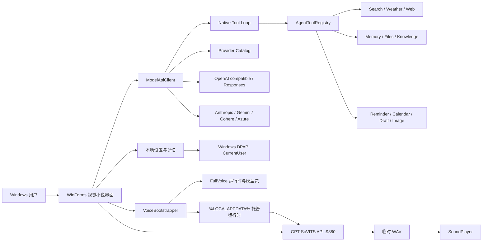

# 彩叶 Iroha Agent Windows 工程验收与交接手册

## 1. 文档控制

| 项目 | 内容 |
|---|---|
| 产品 | 彩叶 Iroha Agent |
| 基线版本 | 2.3.0 |
| 平台 | Windows 10/11 x64 |
| 文档日期 | 2026-07-18 |
| 主程序 | .NET Framework WinForms |
| 模型服务 | 多厂商 HTTP API 适配层 |
| 本地语音 | GPT-SoVITS HTTP API |
| 仓库形态 | Windows-only 源码仓库 |
| 建议验收结论 | 有条件通过 |

“有条件通过”表示：源码构建、独立运行、视觉小说主界面、主要交互、模型与工具协议离线回归、权限边界、文档读取、首次语音部署、重新部署、真实语音生成与发布打包均已通过；各厂商真实计费请求、最终主观听感、第三方素材授权和长时间稳定性仍由发布者在自己的账户与目标设备上确认。

## 2. 产品范围

### 2.1 已交付

- Windows 本地视觉小说式聊天界面。
- 27 个模型服务入口、厂商优先选择、模型选择与独立 API Key 配置。
- 各厂商 API Key 使用 Windows 当前用户级 DPAPI 加密；旧明文配置自动迁移，并同步替换或清理遗留的明文备份与损坏侧文件。
- OpenAI Responses / Chat、Anthropic、Gemini、Cohere 与 Azure OpenAI 协议适配。
- 模型列表刷新、手动模型 ID、自定义 OpenAI 兼容地址与本地 Ollama / LM Studio。
- 中文文字回复、日语 GPT-SoVITS 语音播放。
- GPT-SoVITS OpenAPI 与真实短句推理双重健康检查、失败后一次自动恢复，以及脱离主程序输出管道的无日志后台运行。
- 对话、历史、详情、记忆和逐字动画使用 Unicode 文本元素；组合 Emoji 不拆分，朗读前安全过滤图形并转换常用符号。
- VN 对白框完整回复入口、可滚动详情悬浮窗与模型/工具/语音分阶段加载反馈。
- 中文显示稿与日语语音稿全文等价约束、结构完整性校验、一次修复和错误语音阻断。
- 首次启动自动发现或部署 GPT-SoVITS。
- GSV 模型、参考音频、提示文本和推理配置自动匹配。
- 语音部署实时进度动画和失败降级。
- 设置内安全重新部署。
- 长期记忆、提示词压缩、会话管理和快捷动作。
- A/B/C 三组 18 个 Tools、10 个可选 Skill 工作方式和“工具与隐私”能力中心。
- Brave/Bing 联网搜索、网页读取、提醒、DOCX/PDF 文档读取、本地知识库、天气、本地日历、邮件草稿、图片分析、媒体键和应用白名单。
- OpenAI Responses、OpenAI/DeepSeek Chat、Anthropic、Gemini 与 Cohere 原生 Tool Calling，统一参数校验、确认、超时和轮次限制。
- 自然眨眼、口型和多情绪逐帧动画。
- Portable 与 FullVoice Windows 发布格式。

### 2.2 不在本基线内

- 云端账户、跨设备同步和多用户服务。
- 生产级遥测、远程日志和自动更新。
- 任意模型厂商的账户、配额或 API 费用托管。
- AWS SigV4、Google Vertex OAuth 等非 API-Key 凭据代理。
- 对第三方角色、图片或语音素材的授权承诺。
- 代码签名证书与 Microsoft Store 发布。
- Google/Microsoft 云日历 OAuth 同步、邮件发送、任意 Shell、桌面自动点击和任意文件写删。
- 向量嵌入知识库与跨设备 Tool 数据同步。

## 3. 架构总览



架构保持单体桌面应用：UI、业务编排和 HTTP 客户端位于一个 WinForms 进程；GPT-SoVITS 作为本机子进程提供 `127.0.0.1:9880` 服务。大型运行时与模型不进入 Git 历史，由 FullVoice Release 在首次启动时部署。

## 4. 模块与职责

| 文件或目录 | 职责 | 变更注意事项 |
|---|---|---|
| `desktop/AgentDesktop.cs` | 主窗体、聊天编排、语音请求、记忆、会话和自绘 UI | 业务代码集中，修改后必须跑功能和截图 QA |
| `desktop/ModelProviders.cs` | 厂商目录、配置迁移、协议请求/响应与模型发现 | 新厂商优先复用现有协议，不在 UI 中复制 HTTP 逻辑 |
| `desktop/CredentialProtector.cs` | API Key 的 DPAPI 加密、解密和旧明文迁移 | 不允许降级为明文；跨用户解密失败必须安全清空并提示重填 |
| `desktop/AgentTools.cs` | Tool 注册表、Schema、权限会话、路径/URL 策略和 Skill 目录 | 不能绕过确认、目录授权或调用上限 |
| `desktop/AgentToolExecutors.cs` | 18 个 Tool 的确定性执行、本地存储和文档解析 | 网络、文件和系统操作必须保持最小权限 |
| `desktop/ToolCenterForm.cs` | 能力组、搜索连接、目录、应用白名单和 Skill 设置 | 保持独立浮窗，不遮挡主舞台 |
| `desktop/VoiceBootstrap.cs` | 语音发现、解压、模型导入、配置生成、进度窗和安全清理 | 涉及大文件和进程，必须保持路径边界检查 |
| `desktop/build.ps1` | 调用 .NET Framework `csc.exe` 并复制资源 | 非零编译退出码必须立即失败 |
| `assets/character` | 立绘、表情和逐帧动画 | 发布包必须保留相对目录 |
| `assets/ui` | 背景和界面资源 | 不要用模糊截图覆盖交互控件 |
| `tools/build-windows-release.ps1` | Portable、FullVoice 分卷与哈希清单 | Release 在仓库外生成 |
| `tools/*QaHarness.cs` | 功能、动画、部署和语音自动验收 | 使用隔离数据目录，禁止读取真实 API Key |
| `voice-pack/manifest.json` | 语音包工程元数据 | 不包含模型权重和音频 |

## 5. 首次语音部署

### 5.1 状态流程

1. 检查 `settings.json` 中已匹配的运行时、配置和参考音频。
2. 检查本机配置端口的 `/openapi.json` 是否包含真实 `/tts` 接口。
3. 查找用户指定、应用目录、托管目录和常见位置中的 GPT-SoVITS。
4. 校验 FullVoice 分卷连续性、归档可读性和磁盘空间；解压到独立临时目录。
5. 查找或导入 `.ckpt`、`.pth`、`.wav` 和 `.list`。
6. 从训练列表读取参考音频文件名、日语提示文本和语言。
7. 将有效 `tts_infer_iroha.yaml` 复制或生成到应用可写托管目录，原始运行时保持不变。
8. 新运行时完整校验后原子切换，写入 `.deployment-ready`；失败自动恢复旧运行时。
9. 通过 Python 引导脚本设置独立 Numba 缓存，启动 `api_v2.py` 并按墙钟时间轮询健康状态。
10. 自动处理 `9880-9899` 端口占用并保存实际端口。
11. 保存运行时、配置、参考音频与匹配版本。
12. 进度窗显示完成；以后启动直接连接。

### 5.2 进度区间

| 区间 | 状态 |
|---|---|
| 0-17% | 环境与已有运行时检查 |
| 18-62% | GPT-SoVITS 解压 |
| 64-82% | 彩叶模型和参考音频导入 |
| 86-99% | 本地服务和模型加载 |
| 100% | 健康检查通过 |

进度窗口是独立无边框 owner-drawn 窗体。部署期间主界面仍可查看，文字聊天不依赖语音部署结果。

### 5.3 兼容性策略

自动生成配置默认：

```yaml
device: cpu
is_half: false
```

原因：CPU 全精度不依赖 NVIDIA 驱动、CUDA 版本或可用显存，是跨电脑首次启动最稳定的默认值。未来增加 GPU 模式时，应在设置中显式选择并执行独立能力探测，不能把 GPU 作为无条件默认。

Python 子进程不得通过旧版 `.NET ProcessStartInfo.EnvironmentVariables` 注入变量；部分 Windows 同时存在 `Path` / `PATH` 时会触发大小写冲突。当前使用 `-X utf8 -u` 和托管 `start_voice.py` 设置 `NUMBA_CACHE_DIR`，兼顾实时诊断与跨电脑兼容。

## 6. 重新部署安全约束

“重新部署语音”必须遵守以下不变量：

- 只递归删除 `VoiceBootstrapper.ManagedBaseDirectory` 下的目录。
- 删除前使用绝对路径验证目标位于托管根目录内。
- 不删除桌面原始语音 ZIP。
- 不删除用户自行安装的外部 GPT-SoVITS。
- 没有可恢复的随包运行时归档时，不删除唯一的托管运行时，仅重建语音配置。
- 新部署只在临时目录完成，验证前保留旧运行时；缺失分卷或中断后恢复最后可用版本。
- GPT-SoVITS 使用托管 YAML 副本和缓存目录，不要求外部运行时可写。
- 只停止可执行文件路径位于目标运行时中的 `python/pythonw` 进程。
- 重新部署失败时文字聊天继续可用。

默认托管位置：

```text
%LOCALAPPDATA%\IrohaLocalAgent\VoiceRuntime\
%LOCALAPPDATA%\IrohaLocalAgent\Voice\iroha\
```

## 7. 设置与本地数据

| 数据 | 默认位置 | 内容 |
|---|---|---|
| 应用设置 | 新安装 `%LOCALAPPDATA%\IrohaLocalAgent\settings.json`；旧安装沿用 `%APPDATA%` | 厂商、DPAPI 密文形式的各厂商 Key、模型/地址、语音路径与开关 |
| 长期记忆 | 与设置同目录的 `memory.json` | 用户偏好和本地记忆；原子保存、备份恢复 |
| 本地提醒 | 与设置同目录的 `reminders.json` | 待办时间、完成/取消和通知状态 |
| 本地日历 | 与设置同目录的 `calendar.json` | 本地事件；可导出 ICS |
| 邮件草稿 | 与设置同目录的 `email-drafts.json` | 仅本地草稿，不包含发送能力 |
| 私人知识库 | 与设置同目录的 `knowledge-base.json` | 授权文档的本地文本片段与来源 |
| 托管运行时 | `%LOCALAPPDATA%\IrohaLocalAgent\VoiceRuntime` | 解压后的 GPT-SoVITS |
| 托管模型 | `%LOCALAPPDATA%\IrohaLocalAgent\Voice\iroha` | 权重、参考音频和 YAML |
| 语音缓存 | `%LOCALAPPDATA%\IrohaLocalAgent\VoiceCache` | 无日志 Python 引导脚本与 Numba 缓存 |
| 临时语音 | `%TEMP%\iroha-agent-voice-*.wav` | 播放后删除 |
| 崩溃日志 | `%LOCALAPPDATA%\IrohaLocalAgent\crash.log` | 仅在首个未处理异常时写入，不在主界面展示或上传 |

关键设置字段：

| 字段 | 含义 |
|---|---|
| `ProviderId` | 当前模型厂商的稳定标识 |
| `Model` | 当前厂商的模型 ID；允许目录选择或手动输入 |
| `BaseUrl` | 当前厂商 API 根地址 |
| `ProviderApiKeys` | 按厂商隔离的 Key 映射；内存中为明文，保存副本中为 DPAPI 密文 |
| `ProviderModels` | 按厂商保存的最后模型映射 |
| `ProviderBaseUrls` | 按厂商保存的接口地址映射 |
| `VoiceRuntimeRoot` | 当前使用的 GPT-SoVITS 根目录 |
| `VoiceRuntimeConfigPath` | 当前推理 YAML |
| `VoiceRefAudioPath` | 当前参考音频 |
| `VoicePromptText` | 参考音频对应的日语文本 |
| `VoicePromptLang` | 默认 `ja` |
| `VoiceAutoMatched` | 是否已完成自动匹配 |
| `VoiceMatchVersion` | 匹配规则版本，当前为 3 |
| `ToolsEnabled` / `ToolBundle*Enabled` | Tool 总开关与 A/B/C 能力组开关 |
| `WebSearchProvider` / `BraveSearchApiKey` | 搜索路由与 DPAPI 加密的可选搜索 Key |
| `ToolAllowedDirectories` | 文件工具可读取的目录白名单 |
| `ToolAllowedApplications` | 应用启动 Tool 的名称和 EXE 白名单 |
| `EnabledSkills` | 当前启用的 10 个工作方式 ID |

## 8. 构建

### 8.1 主程序

```powershell
cd desktop
.\build.ps1
```

构建成功条件：

- `desktop/dist/IrohaAgent.exe` 存在。
- `desktop/dist/assets` 只包含 20 项运行时白名单资源：高清背景、主立绘、4 张表情层、Q 版卡片与 13 张会话头像。
- 编译器返回码为 0。
- 发布目录不包含用户设置和密钥。

### 8.2 Release

```powershell
.\tools\build-windows-release.ps1 -Version 2.3.0
```

完整语音版：

```powershell
.\tools\build-windows-release.ps1 `
  -Version 2.3.0 `
  -FullVoice `
  -RuntimeArchive "C:\path\GPT-SoVITS-runtime.7z" `
  -VoicePackage "C:\path\iroha-model.zip"
```

发布脚本默认先执行统一回归，再完成构建、复制、敏感文件检查、Portable ZIP、FullVoice 1.9 GB 分卷、Release 说明和 SHA-256 清单。仅诊断时才允许显式使用 `-SkipQa`。

## 9. 验收矩阵

| 编号 | 验收项 | 结果 | 证据 |
|---|---|---|---|
| W-01 | Windows 编译 | 通过 | `desktop/build.ps1` |
| W-02 | 无系统边框与视觉小说主界面 | 通过 | v2.1 标准与设置截图证据 |
| W-03 | 标准与紧凑窗口主要控件可见 | 通过 | v2.1 功能 QA |
| W-04 | 会话重命名、删除、置顶 | 通过 | v2.1 功能 QA |
| W-05 | 设置浮窗和重新部署入口无重叠 | 通过 | v2.1 功能 QA |
| W-06 | Flash / Pro 徽标状态 | 通过 | v2.1 功能 QA |
| W-07 | 高清背景或立绘缺失、损坏时阻止占位 UI | 通过 | v2.1 视觉资源保护 QA |
| W-08 | 会话菜单关闭期间保持存活并在消息处理后释放 | 通过 | v2.1.1 功能 QA |
| V-01 | 真实服务健康检查 | 通过 | v2.1 完整语音 QA |
| V-02 | 日语 WAV 生成 | 通过 | 4.74 秒音频 |
| V-03 | 音频非静音与自动峰值处理 | 通过 | 峰值约 -1.1 dBFS |
| V-04 | SoundPlayer 播放和临时文件清理 | 通过 | v2.1 完整语音 QA |
| B-01 | 已有外部运行时自动匹配 | 通过 | v2.1 Bootstrap QA |
| B-02 | FullVoice 7-Zip 自动部署 | 通过 | v2.1 Bootstrap QA 与完整解压 |
| B-03 | GSV 权重、参考音频和提示文本导入 | 通过 | v2.1 Bootstrap QA |
| B-04 | 重新部署替换托管旧文件 | 通过 | v2.1 Bootstrap QA |
| B-05 | 源语音包哈希不变 | 通过 | v2.1 Bootstrap QA |
| B-06 | 外部运行时哨兵文件不变 | 通过 | v2.1 Bootstrap QA |
| B-07 | 分卷缺失时保留最后可用运行时并指出具体分卷 | 通过 | v2.1.1 Bootstrap QA |
| B-08 | 只读运行时 YAML 复制到托管目录且源哈希不变 | 通过 | v2.1.1 Bootstrap QA |
| B-09 | 跨 Windows 用户路径自动重新匹配 | 通过 | v2.1.1 Bootstrap QA |
| M-01 | 记忆原子保存、并发写入与损坏恢复 | 通过 | v2.1.1 Memory QA |
| M-02 | 一次性任务和 API 密钥不进入长期记忆 | 通过 | v2.1.1 Memory QA |
| C-01 | 当前用户 DPAPI 加解密与多厂商 Key 切换 | 通过 | v2.2.1 Security QA |
| C-02 | 旧明文、遗留备份与损坏侧文件自动迁移，损坏密文安全失效 | 通过 | v2.2.1 Security QA |
| C-03 | 远程 HTTP 拒绝携带 Key、URL 凭据拒绝、错误脱敏 | 通过 | v2.2.1 Security QA |
| A-01 | Cohere 模型发现固定使用 `/v1/models` | 通过 | v2.2.1 Security QA |
| T-01 | 18 个 Tool 唯一注册、Schema 与风险等级 | 通过 | v2.3 Agent Tools QA |
| T-02 | 五类模型原生 Tool 请求与响应解析 | 通过 | v2.3 Agent Tools QA |
| T-03 | DPAPI 搜索 Key、目录越界、SSRF、确认拒绝和结果截断 | 通过 | v2.3 Agent Tools QA |
| T-04 | TXT、DOCX 与真实 PDF 读取、知识库索引和检索 | 通过 | v2.3 Agent Tools QA |
| T-05 | 提醒、日历和本地写操作确认 | 通过 | v2.3 Agent Tools QA |
| T-06 | OpenAI、Anthropic、Gemini、Cohere 与兼容接口图片载荷 | 通过 | v2.3 Agent Tools QA |
| U-01 | 能力中心三页高 DPI 无重叠 | 通过 | v2.3 Settings UI QA |
| U-02 | 紧凑布局语音 Dock 子控件完整可见且不与输入区、底栏相交 | 通过 | 2026-07-19 Settings UI QA 与截图 |
| U-03 | `980×552` 至 `1920×1080` 的快捷操作、输入、语音和能力卡片无黑边、残影或交叠 | 通过 | 2026-07-19 UI Stability 261 项 QA 与四张截图 |
| U-04 | 150% Windows 缩放下快捷按钮无方形底色，附件与发送按钮保持圆形、分离且不贴边 | 通过 | 2026-07-20 Bottom UI 338 项 QA、实机截图与前后对比 |
| U-05 | 附件常态只显示无白边回形针，发送纸飞机独立绘制且不重影；整个会话输入栏可接收受支持的单文件拖放，附件状态和错误反馈完整 | 通过 | 2026-07-20 Attachment Drop；684 项统一回归，其中 47 项功能 QA、382 项 UI QA，并完成 1920×1080 D 盘实机截图复核 |
| U-06 | 对白框详情入口在 8 组窗口尺寸下不压住正文；长回复滚动窗、分阶段加载动画和异常退出加载态完整 | 通过 | 2026-07-21 Response UX；60 项功能 QA、429 项 Settings UI QA 与 4 张截图 |
| V-05 | 日语语音逐句覆盖中文全文，不完整文本补全一次后仍失败则阻止播放；完整多句 WAV 可生成、校验和播放 | 通过 | 2026-07-21 Full Reply Voice QA；25.48 秒 WAV、10 项真实回归 |
| U-07 | Emoji、肤色、旗帜和 ZWJ 组合在对话、历史、详情与逐字动画中保持完整；无孤立 UTF-16 代理项 | 通过 | 2026-07-21 Voice Recovery & Unicode；69 项功能 QA、764 项统一回归 |
| V-06 | GPT-SoVITS 使用真实推理验活；假在线时自动恢复，主程序退出后服务仍可生成，且不持久化语音文本日志 | 通过 | 2026-07-21 Voice Recovery；10 项真实回归及退出后独立 `/tts` 验证 |
| P-01 | Portable ZIP 与哈希 | 通过 | 发布脚本 QA |
| P-02 | FullVoice 五分卷与哈希 | 通过 | 发布脚本 QA |
| P-03 | 不重压缩高清素材的运行时资源白名单、启动与体积优化 | 通过 | 2026-07-21 Performance；ZIP 9,895,213 字节，启动中位数 311.4 ms，解压包独立启动通过 |

## 10. 验收证据索引

```text
docs/evidence/round-2026-07-16-v21-functional-qa.txt
docs/evidence/round-2026-07-16-v21-bootstrap-qa.txt
docs/evidence/round-2026-07-16-v21-full-voice-qa.txt
docs/evidence/round-2026-07-16-v21-visual-asset-guard-qa.txt
docs/evidence/round-2026-07-16-v21-deployment-progress.png
docs/evidence/round-2026-07-16-v21-settings.png
docs/evidence/round-2026-07-16-v21-standard.png
docs/evidence/round-2026-07-17-v211-functional-qa.txt
docs/evidence/round-2026-07-17-v211-bootstrap-qa.txt
docs/evidence/round-2026-07-17-v211-memory-qa.txt
docs/evidence/round-2026-07-17-v211-full-voice-qa.txt
docs/evidence/round-2026-07-18-v221-security-qa.txt
docs/evidence/round-2026-07-18-v221-settings-ui-qa.txt
docs/evidence/round-2026-07-18-v221-model-settings.png
docs/evidence/round-2026-07-18-v221-voice-settings.png
docs/evidence/round-2026-07-18-v23-agent-tools-qa.txt
docs/evidence/round-2026-07-18-v23-settings-ui-qa.txt
docs/evidence/round-2026-07-18-v23-tools-center.png
docs/evidence/round-2026-07-18-v23-tools-privacy.png
docs/evidence/round-2026-07-18-v23-tools-skills.png
docs/evidence/round-2026-07-19-v23-ui-stability-main.png
docs/evidence/round-2026-07-19-v23-ui-stability-compact.png
docs/evidence/round-2026-07-19-v23-ui-stability-minimum.png
docs/evidence/round-2026-07-19-v23-ui-stability-tools.png
docs/evidence/round-2026-07-19-v23-ui-stability-qa.txt
docs/evidence/round-2026-07-20-v23-bottom-ui-comparison.png
docs/evidence/round-2026-07-20-v23-bottom-ui-final.png
docs/evidence/round-2026-07-20-v23-bottom-ui-qa.txt
docs/evidence/round-2026-07-20-v23-attachment-drop-main.png
docs/evidence/round-2026-07-20-v23-attachment-drop-control.png
docs/evidence/round-2026-07-20-v23-attachment-drop-functional-qa.txt
docs/evidence/round-2026-07-20-v23-attachment-drop-settings-ui-qa.txt
docs/evidence/round-2026-07-21-v23-response-main.png
docs/evidence/round-2026-07-21-v23-response-loading.png
docs/evidence/round-2026-07-21-v23-response-detail.png
docs/evidence/round-2026-07-21-v23-response-minimum.png
docs/evidence/round-2026-07-21-v23-response-functional-qa.txt
docs/evidence/round-2026-07-21-v23-response-settings-ui-qa.txt
docs/evidence/round-2026-07-21-v23-full-reply-voice-qa.txt
docs/evidence/round-2026-07-21-v23-response-performance.txt
docs/evidence/round-2026-07-21-v23-voice-recovery-unicode-functional.txt
docs/evidence/round-2026-07-21-v23-voice-recovery-unicode-summary.txt
docs/evidence/round-2026-07-21-v23-voice-recovery-live.txt
```

## 11. 故障排查

| 现象 | 检查 | 处理 |
|---|---|---|
| 首次部署找不到运行时 | FullVoice 的 `voice-runtime` 和全部分卷是否完整 | 重新完整解压发布包 |
| 提示缺少 7-Zip | `voice-runtime/tools/7z.exe` 与 `7z.dll` | 重新下载 FullVoice |
| 部署磁盘不足 | `%LOCALAPPDATA%` 所在磁盘剩余空间 | 至少释放 20 GB |
| 服务启动超时 | CPU 占用、杀毒软件、Numba 缓存 | 等待进度；应用最长 10 分钟后清理本次进程，可重新部署 |
| 端口被占用 | `9880-9899` 是否有其他服务 | 应用自动选择可用端口并保存，不需要手工改端口 |
| OpenAPI 可访问但无音频 | 是否存在真实 `/tts`、YAML 权重路径和参考音频 | 应用先执行真实短句探针并自动恢复一次；仍失败再点击重新部署 |
| 记忆突然为空 | `memory.json.bak` 与 `.corrupt` | 应用会自动从备份恢复；保留损坏副本供人工核查 |
| 语音很小或静音 | WAV 长度、峰值和 RMS | 应用会拒绝无效/近静音响应并显示不可用 |
| 只有文字没有声音 | 语音开关、服务状态、系统输出设备 | 开启日语语音并试听 |
| 模型无回复 | 厂商、API Key、模型 ID、Base URL、网络和账户余额 | 确认 Key 属于所选厂商；刷新模型或按控制台 ID 手动填写后测试 |
| `401/403` | Key 是否属于当前厂商且有模型权限 | 切回正确厂商或更新该厂商独立 Key |
| `404` | 模型 ID 与 API 根地址是否匹配 | 恢复厂商默认地址并刷新模型列表 |
| Ollama / LM Studio 无回复 | 本地服务是否启动并已加载模型 | 启动服务，刷新模型并确认 `127.0.0.1` 端口 |
| 点击会话菜单后反复弹错 | 旧版 `crash.log` 是否包含 `ContextMenuStrip` / `ObjectDisposedException` | 升级至 v2.1.1；菜单改为延迟释放，同一次运行不会重复弹全局错误 |
| 模型不调用 Tool | Tool 总开关、能力组和所选模型是否支持函数调用 | 开启对应能力组；旧接口不支持 Schema 时会安全降级为普通聊天 |
| 文件读取被拒绝 | 文件是否在授权目录或经过目录联接 | 在能力中心添加真实目录；符号链接/联接路径不会放行 |
| 图片只有基础信息 | 当前模型是否支持视觉输入 | 更换多模态模型；OCR 仅在本机存在 Tesseract 时补充 |
| 日程没有同步手机 | 当前日历是否为本地模式 | 导出 ICS 后导入其他日历；v2.3.0 不接入云 OAuth |

## 12. 安全与隐私

- 任意厂商 API Key 不写入源码、Release、截图或 QA 报告。
- 各厂商 Key 使用 Windows DPAPI `CurrentUser` 加密落盘；旧明文配置及其 `.bak`、`.corrupt` 侧文件自动迁移或清理，跨用户密文无法解密时安全失效并提示重填。
- 携带 Key 的远程 API 地址必须使用 HTTPS；URL 内嵌用户名或密码会被拒绝，厂商错误文本会进行密钥脱敏。
- 本地 HTTP 语音服务只绑定 `127.0.0.1`。
- Release 构建检查 `settings.json`、`memory.json`、`.env` 和日志。
- 设置与记忆使用原子替换和最后有效备份；长期记忆拒绝 API Key、密码和 token。
- Tool 写入、删除、剪贴板、图片与系统控制均为单次确认；模型普通文本不能触发动作。
- 文件 Tool 仅访问用户授权目录并拒绝符号链接逃逸；应用只启动无参数 EXE 白名单。
- URL Tool 阻止本机、私网、云元数据、URL 凭据、非 HTTP(S) 协议和危险重定向。
- 工具循环最多 4 轮、每轮 8 次，单个结果约 48 KiB；网页响应、文档文本与存储数量均有上限。
- 语音 ZIP 作为只读源使用，导入写入应用托管目录。
- Git 忽略权重、音频、运行时、EXE 和发布归档。
- 公开发布前必须完成第三方素材授权核查。

## 13. 后续扩展原则

### 13.1 UI

- 保持视觉小说主视图，不回退为普通后台表单。
- 新功能优先进入设置浮窗或独立页面，避免遮挡角色和对白框。
- 图标必须与真实功能一一对应。
- 所有新增控件必须验证 1280×720 与 980×552。
- 语音 Dock 的遥测信息应按可用宽度降级，不得仅因高 DPI 下控件高度变小而隐藏波形和引擎状态。
- 透明自绘按钮必须使用与轮廓一致的 `Region`，并在 125%/150% 缩放的实际桌面合成画面中检查父控件重绘底色。

### 13.2 语音

- 将“部署、配置、进程、健康、合成、播放”保持分层。
- GPU 加速作为显式可选项，不改变 CPU 稳定默认。
- 升级匹配规则时递增 `CurrentMatchVersion`。
- 新增运行时版本时保留旧配置迁移与重新部署回退。

### 13.3 记忆与模型

- 记忆数据结构变更必须版本化并提供迁移。
- 提示词压缩不能改变用户请求的核心意图。
- 角色人设、中文显示与日语语音的双语契约必须保持。
- 模型接口变更在 `ModelProviders.cs` 的协议边界内完成；UI 和聊天业务不得直接拼装厂商 HTTP 请求。
- 新厂商先映射现有协议；只有鉴权、端点或响应结构确实不同才新增适配器。
- 厂商切换必须保持 Key、模型和 Base URL 隔离，并保留旧 DeepSeek 设置迁移。

### 13.4 Tools 与 Skills

- 新 Tool 必须先定义参数 Schema、风险等级、超时、结果上限和验收用例，再接入模型。
- 只读不等于无限权限；网络仍需 SSRF 防护，文件仍需目录白名单。
- 任何写入、删除、发送、剪贴板、图片上传或系统控制必须走统一确认窗。
- 新协议只能在 `ModelProviders.cs` 的规范化会话边界增加适配，不得在执行器中耦合厂商 JSON。
- MCP 可作为未来连接层，但不能绕过本地注册表和权限策略。

## 14. 技术债务

| 优先级 | 项目 | 建议 |
|---|---|---|
| P1 | `AgentDesktop.cs` 体积过大 | 按 UI、Memory、Voice、Conversation 拆分；模型协议已先独立到 `ModelProviders.cs` |
| P1 | `AgentToolExecutors.cs` 仍包含多个领域 | 按网络、资料、生活助理和本地存储拆分，同时保留统一注册表 |
| P2 | 云端模型只做离线协议回归 | 使用发布者自己的低权限测试 Key 做逐厂商冒烟测试，禁止把 Key 写入 CI |
| P2 | 日历仅本地、知识库仅关键词检索 | 先设计 OAuth/撤销流程和可选嵌入层，再增加云同步与语义检索 |
| P2 | URL 连接前只做 DNS 预检 | 后续采用可固定解析结果的网络栈，进一步降低 DNS rebinding 风险 |
| P2 | GPT-SoVITS 诊断仅保存在内存 | 可选诊断模式写入大小受限、自动轮换且不含聊天内容的日志 |
| P2 | 日语全文校验以提示词、长度、分句和数字覆盖为主 | 后续可增加本地双语句对齐器；在此之前校验失败时继续坚持不播放，而不是放宽完整性要求 |
| P2 | CPU 默认启动较慢 | 增加经过探测的 GPU 可选模式 |
| P2 | 首次部署不可暂停/取消 | 增加可恢复解压和取消令牌 |
| P2 | 缺少代码签名 | 发布前接入签名证书和 SmartScreen 流程 |
| P3 | 无自动更新 | 在授权和签名完成后再设计更新通道 |

## 15. 交接清单

- [ ] `main` 分支只包含预期源码和文档。
- [ ] `desktop/build.ps1` 编译通过。
- [ ] 功能、Bootstrap 和真实语音 QA 全部通过。
- [ ] Agent Tools 61 项回归和能力中心截图 QA 全部通过。
- [ ] Settings UI 429 项多尺寸、透明底色、圆角 Region、详情入口、加载状态、附件图标归属、拖放命中区与像素边缘回归全部通过。
- [ ] Functional QA 69 项主要交互回归全部通过，包括完整回复、语音完整性、Unicode/Emoji、文件拖放、附件提示和非法格式拦截。
- [ ] 真实完整语音 10 项回归通过，并确认多句 WAV 时长、非静音、响度、播放和清理。
- [ ] 统一回归 764 项全部通过，并确认主程序退出后 GPT-SoVITS 仍可独立完成真实 `/tts` 请求且不生成对话日志。
- [ ] Portable 与 FullVoice Release 均生成 SHA-256。
- [ ] Git 历史不含 API Key、用户设置、权重、音频和运行时。
- [ ] FullVoice 全部分卷齐全并可从 `.001` 解压。
- [ ] 发布者已确认角色、图片和语音再分发授权。
- [ ] 计划发布的模型厂商至少各完成一轮真实账户聊天；Key 不进入证据文件。
- [ ] 目标电脑完成一次首次语音部署和试听。
- [ ] 版本号、标签、Release Notes 和验收证据一致。

<!-- pagebreak -->

## 16. 签署

| 角色 | 姓名 | 日期 | 结论 |
|---|---|---|---|
| 开发交付 |  |  |  |
| 工程复核 |  |  |  |
| 产品验收 |  |  |  |
| 素材授权复核 |  |  |  |

建议签署文本：

> Iroha Agent v2.3.0 Windows 基线在构建、主要功能、多厂商模型与原生 Tool 协议、DPAPI 凭据保护、文件/网络权限边界、视觉小说界面、事务式语音部署、安全重新部署、记忆恢复、文档与知识库、真实语音生成和发布打包方面通过工程验收。各厂商真实计费请求、目标设备长时稳定性与第三方素材授权由发布者完成最终确认。
